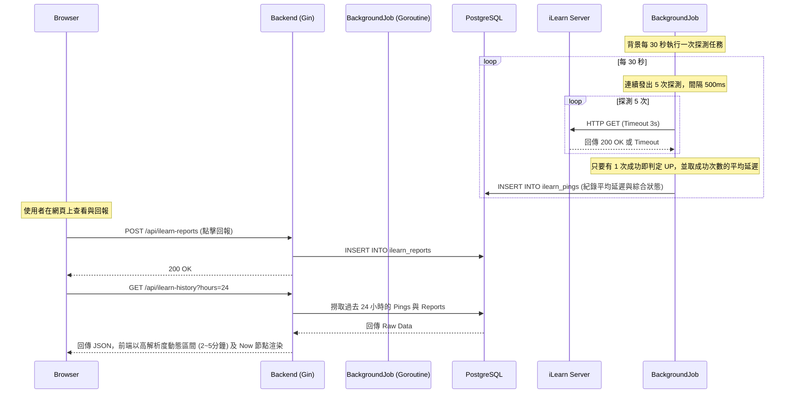

# AurorNote 後端架構與技術解析 (Backend Architecture)

本文件詳細解析 AurorNote 專案的後端底層架構。後端採用 Golang 搭配 Gin 框架與 GORM 打造，遵循標準的 RESTful API 設計與 MVC 變體架構，具備極高的效能與嚴謹的權限防護網。

---

## 1. 後端技術棧與整體架構概述
- **架構類型**: RESTful API Server (無狀態伺服器)
- **核心語言**: Golang (Go 1.21+)
- **網路框架**: Gin Web Framework (負責高效能的 HTTP 路由派發與 Middleware 攔截)
- **資料庫通訊**: GORM (Object Relational Mapping) 搭配 `pgx` 底層驅動
- **身分驗證**: JWT (JSON Web Tokens) 無狀態驗證機制
- **密碼加密**: Bcrypt (單向雜湊演算法)

---

## 2. 檔案目錄結構與職責劃分 (Tree Architecture)

```text
backend/
├── main.go                     # [系統啟動點] 初始化 DB 連線、執行資料庫欄位補丁與種子密碼雜湊校正、註冊全域路由、並啟動 Gin Server (Port 8000)
├── assets/                     # [靜態資源層] (儲存所有筆記上傳的圖片與檔案)
│   ├── images/                 # 筆記封面圖與截圖 (經由 /media/images 對外服務)
│   └── note-files/             # 筆記可下載檔案 (經由 API 授權下載)
├── database/                   # [資料庫連線層]
│   └── db.go                   # 建立與 PostgreSQL 的連線池，並初始化全域的 GORM DB 實例
├── models/                     # [資料映射層 ORM]
│   ├── user.go, note.go...     # 定義與資料庫 Table 一對一對應的 Go Struct (包含 GORM Tags 與 JSON 序列化規則)
├── routes/                     # [路由層]
│   └── routes.go               # 集中定義所有的 HTTP API 端點 (GET/POST/PUT/DELETE) 與其對應的 Controller
├── controllers/                # [業務邏輯層] (系統心臟)
│   ├── auth_controller.go      # 登入、註冊邏輯 (包含 Bcrypt 密碼比對與 JWT 簽發)
│   ├── note_controller.go      # 筆記清單查詢、搜尋、詳情瀏覽
│   ├── cart_controller.go      # 購物車管理 (加入、移除、查詢)
│   ├── seller_controller.go # 賣家專屬：上架筆記、上傳素材、查看銷售數據
│   ├── csr_controller.go       # 客服專屬：審核退款申請
│   ├── admin_controller.go     # 系統管理員專屬：帳號停權、權限變更、強制下架
│   ├── user_controller.go      # 使用者個人資料管理
│   ├── social_controller.go    # 好友、黑名單、訊息、退款申請與評論管理
│   ├── library_controller.go   # 筆記庫閱讀授權與願望清單
│   ├── transaction_controller.go # 結帳交易處理 (包含嚴謹的 Database Transaction) 與歷史交易紀錄查詢
│   ├── status_controller.go    # 系統監測與儀表板狀態回報
│   └── seller_controller_test.go # 賣家專屬控制器的單元測試
├── middleware/                 # [中介軟體防護層]
│   ├── auth_middleware.go      # [第一道防線] 攔截請求，解密 JWT Token，並將 User ID 寫入 Context
│   └── role_middleware.go      # [第二道防線] 檢查 Context 內的使用者 Role 是否具備特定操作權限
└── utils/                      # [共用工具層]
    ├── jwt.go                  # 提供 JWT Token 的生成 (Generate) 與驗證 (Validate) 演算法
    └── ilearn_jobs.go          # [背景任務] 定期向外發送 Ping 請求的 Background Goroutine
```

---

## 3. 核心模組深度解析 (Core Modules Details)

### 🔴 網路與路由層 (Router Layer) - `routes/` & `main.go`
- **職責**: 定義所有對外開放的 API 閘口。負責將前端送來的 HTTP 請求 (如 `GET /api/notes`) 精準地派發給對應的 Controller。
- **核心機制**:
  - **分組管理 (RouterGroup)**: 透過 Gin 的分組功能，將 API 劃分為 `/api/auth` (公開)、`/api/protected` (需登入)、`/api/seller` (需賣家權限) 等群組。
  - **防護網綁定**: 直接在群組層級掛載 Middleware，確保駭客無法繞過驗證直接訪問底層 API。

### 🟡 中介軟體防護層 (Middleware Layer) - `middleware/`
- **職責**: 在請求真正抵達 Controller 之前，執行全域的攔截、過濾與狀態解析。
- **核心機制**:
  - **`RequireAuth()`**: 檢查 HTTP Header `Authorization: Bearer <token>`。若無效直接退回 `401 Unauthorized`；若有效，則解析出使用者的 ID 與 Role 存入 `*gin.Context`，讓後續的 Controller 不必再重新查資料庫。
  - **`RequireRole(role)`**: 針對高權限 API 的檢查哨。它會從 Context 拿出當前登入者的身分進行比對。（系統特別賦予了 `ADMIN` 角色「跨越所有職位限制」的超級特權，可暢通無阻）。

### 🟢 業務邏輯與控制層 (Controller Layer) - `controllers/`
- **職責**: 負責接收前端傳來的參數、執行商業邏輯、並向資料庫發號施令。
- **核心機制**:
  - **資料綁定**: 透過 `c.ShouldBindJSON()` 自動將前端傳來的 JSON 字串轉換為 Go 的 Struct 型別。
  - **交易確保 (Database Transaction)**: 對於具備高度關聯的操作（例如「購物車結帳」牽涉到清空購物車、新增訂單主檔、新增明細檔、發放筆記授權四個動作），會強制開啟 GORM Transaction，確保 ACID (Atomic) 特性，任何一步出錯就全數 Rollback。
  - **無痕 Schema 擴充機制 (Schema-less Data Extension)**: 為了在不修改底層 Database Schema (`reviews` 表) 的情況下實作評論的特權身分科目，Controller 採用了「隱藏字首機制」。當買家以 `ADMIN`、`CSR` 或 `AUTHOR` 等特權發表評論時，Controller 會在存入資料庫前自動將 `[ROLE:XXX]` 綴於文字前方；並在回傳給前端 (`GET`) 時自動將其解析分離，轉為獨立的 `posted_as_role` 屬性，達成低成本且靈活的功能擴充。
  - **標準化輸出**: 統一透過 `c.JSON(http.StatusOK, gin.H{...})` 輸出標準化的 JSON 格式給前端。

### 🔵 資料映射層 (Model Layer) - `models/`
- **職責**: 負責 Go 結構體 (Struct) 與關聯式資料庫 (PostgreSQL Tables) 之間的溝通橋樑。
- **核心機制**:
  - **Struct Tags 定義**: 透過 `gorm:"primaryKey;column:user_id"` 來約束資料庫行為，並透過 `json:"id"` 來決定前端收到的 JSON Key 名稱。
  - **智慧關聯 (Preload/Foreign Key)**: 透過 `references:NoteID` 等設定，讓 GORM 知道如何在不同 Table 之間進行 JOIN。例如在查詢「購物車」時，能自動一併撈出關聯的「筆記詳細資訊」。

---

## 4. API 請求生命週期 (API Request Lifecycle)

以「賣家上架新筆記」為例，從前端發出請求到資料庫寫入的完整生命週期如下：

```text
1. [接收請求] 瀏覽器向 Caddy 送出 HTTP POST /api/seller/notes，Caddy 將其反向代理至 Go Server (Port 8000)。
2. [Token 驗證] 請求進入 auth_middleware.go，成功驗證簽章並解析出 JWT 內容，將 user_id 放入 Context。
3. [權限驗證] 請求進入 role_middleware.go，確認該使用者的 role 為 SELLER (或超級管理員 ADMIN)，准許放行。
5. [路由派發] 根據 routes.go 的註冊表，請求被轉交給 NoteController 的 CreateNote() 函數。
6. [參數綁定] Controller 透過 c.ShouldBindJSON() 把前端傳來帶有 title, price 的 JSON 轉換為 Go 的 Struct。
7. [寫入準備] Controller 從 Context 中提取出賣家 ID，並補齊到要寫入的 Struct 中。
8. [執行 SQL] 呼叫 database.DB.Create()，GORM 自動將這個 Struct 翻譯成 INSERT INTO notes... 的 SQL 語法。
9. [底層通訊] pgx Driver 透過 TCP 連線，將 SQL 語法傳送到 PostgreSQL 資料庫執行。
10. [回傳結果] 寫入成功後，Controller 透過 c.JSON 打包 HTTP Status 201 Created 與成功訊息，回傳給前端。
```

### 4.1 iLearn 狀態監測機制 (iLearn Monitoring Flow)
這個機制展示了背景任務如何與公開 API 及外部系統互動：


